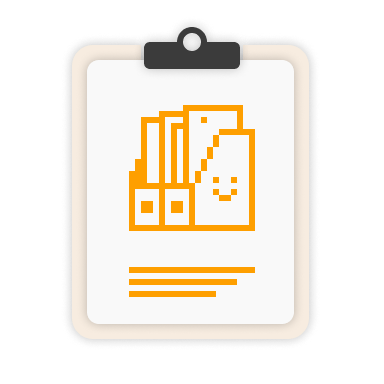

# Link Generator for sosumi.ai

  

A Chrome extension that copies Apple Developer documentation and HIG links as `sosumi.ai` links.

## Disclaimer
1. **Unofficial Project:** This extension is an independent open-source project and is strictly **NOT** affiliated with, endorsed by, or associated with Apple Inc. or sosumi.ai.
2. **Trademarks:** "Apple", "Xcode", and related marks are trademarks of Apple Inc.
3. **Functionality:** This tool is a utility strictly restricted to generating URLs by manipulating the text string of the current page's address. It does not crawl, scrape, cache, or modify Apple's content, nor does it attempt to bypass authentication or security measures.
4. **No Data Collection:** This extension operates entirely client-side within your browser. It does not track browsing history, nor does it collect, store, or transmit any user data or credentials.
5. **External Service Dependency:** This tool relies entirely on the availability and functionality of the third-party service "sosumi.ai". The developer of this extension has no control over sosumi.ai and assumes no responsibility for service interruptions, changes in URL structure, or discontinuation of their service. Please refer to [sosumi.ai's website](https://sosumi.ai) for their specific Terms and Conditions.
6. **User Responsibility:** All rights to the underlying documentation content remain with Apple Inc. You are solely responsible for complying with Apple's Terms of Use and applicable laws when accessing the links generated by this tool. The developer assumes no liability for how you use the generated links.
7. **NO WARRANTY ("AS IS"):** THE SOFTWARE IS PROVIDED "AS IS", WITHOUT WARRANTY OF ANY KIND, EXPRESS OR IMPLIED, INCLUDING BUT NOT LIMITED TO THE WARRANTIES OF MERCHANTABILITY, FITNESS FOR A PARTICULAR PURPOSE AND NONINFRINGEMENT. IN NO EVENT SHALL THE AUTHORS OR COPYRIGHT HOLDERS BE LIABLE FOR ANY CLAIM, DAMAGES OR OTHER LIABILITY, WHETHER IN AN ACTION OF CONTRACT, TORT OR OTHERWISE, ARISING FROM, OUT OF OR IN CONNECTION WITH THE SOFTWARE OR THE USE OR OTHER DEALINGS IN THE SOFTWARE.

## Credit & License
This extension is inspired by and uses assets from [sosumi.ai](https://sosumi.ai).

### sosumi.ai License

Copyright 2025 NSHipster (https://nshipster.com)

Permission is hereby granted, free of charge, to any person obtaining a
copy of this software and associated documentation files (the "Software"),
to deal in the Software without restriction, including without limitation
the rights to use, copy, modify, merge, publish, distribute, sublicense,
and/or sell copies of the Software, and to permit persons to whom the
Software is furnished to do so, subject to the following conditions:

The above copyright notice and this permission notice shall be included in
all copies or substantial portions of the Software.

THE SOFTWARE IS PROVIDED "AS IS", WITHOUT WARRANTY OF ANY KIND, EXPRESS
OR IMPLIED, INCLUDING BUT NOT LIMITED TO THE WARRANTIES OF MERCHANTABILITY,
FITNESS FOR A PARTICULAR PURPOSE AND NONINFRINGEMENT. IN NO EVENT SHALL THE
AUTHORS OR COPYRIGHT HOLDERS BE LIABLE FOR ANY CLAIM, DAMAGES OR OTHER
LIABILITY, WHETHER IN AN ACTION OF CONTRACT, TORT OR OTHERWISE, ARISING
FROM, OUT OF OR IN CONNECTION WITH THE SOFTWARE OR THE USE OR OTHER
DEALINGS IN THE SOFTWARE.